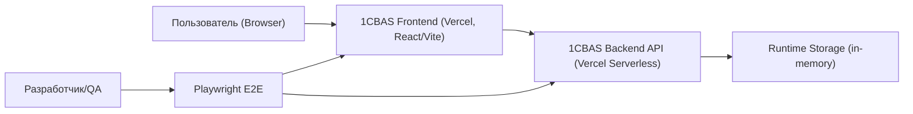
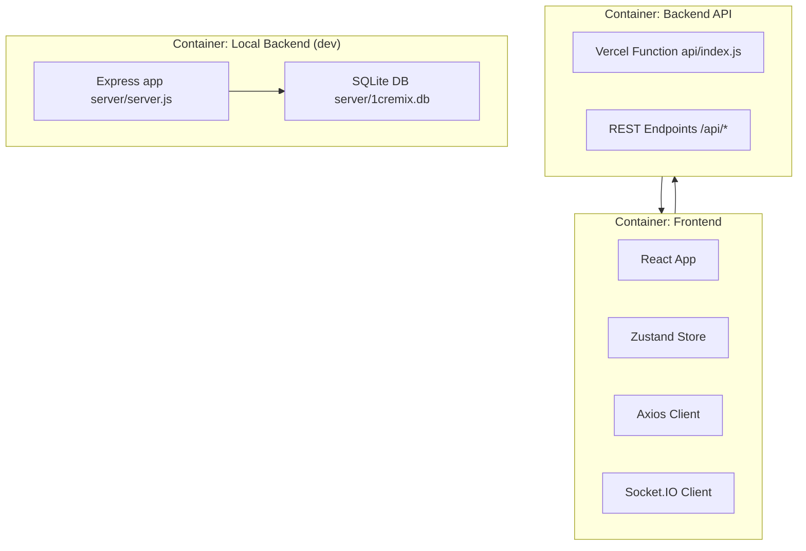
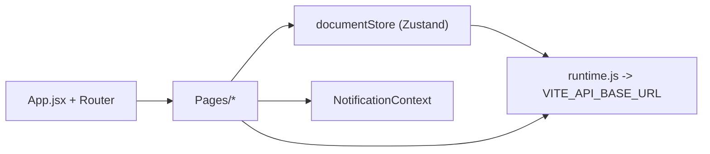
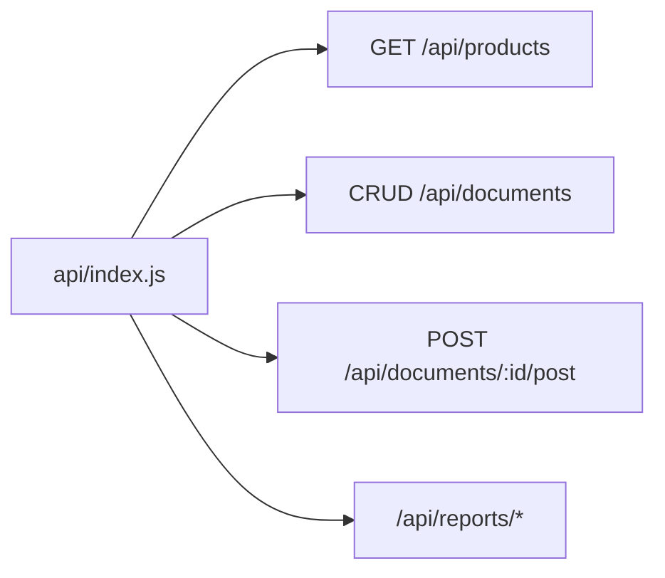
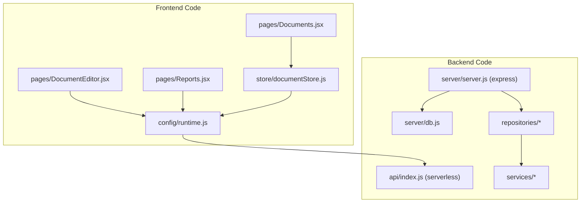
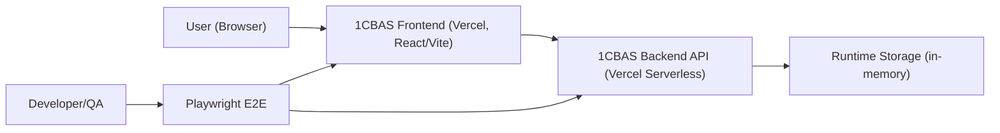

# C4 Architecture Documentation (RU/EN)

## RU

### Уровень 1: System Context

Описание:
- Пользователь работает с веб-интерфейсом.
- Frontend вызывает backend API.
- Backend в текущем Vercel serverless варианте использует runtime storage (непостоянное хранилище).
- QA/разработчик проверяет сценарии через Playwright.

### Уровень 2: Containers

Описание:
- Production split-hosting: frontend и backend развернуты отдельно.
- Локально backend может работать как Express + SQLite.

### Уровень 3: Components

#### Frontend Components

Ключевые компоненты frontend:
- `client/src/App.jsx`: маршрутизация.
- `client/src/pages/*`: экраны UI (Dashboard, Documents, Editor, Reports и др.).
- `client/src/store/documentStore.js`: загрузка/фильтрация документов, сокеты.
- `client/src/config/runtime.js`: runtime-конфиг API/Socket.

#### Backend Components

Ключевые компоненты backend:
- `api/index.js`: serverless entrypoint, маршруты API, CORS, обработка JSON.
- `server/server.js` + `server/controllers/*` + `server/repositories/*`: локальный полнофункциональный backend.

### Уровень 4: Code/Modules

---

## EN

### Level 1: System Context

Summary:
- User interacts with the web UI.
- Frontend calls backend API.
- Current Vercel serverless backend uses runtime storage (non-durable).
- QA/developers validate flows via Playwright tests.

### Level 2: Containers

### Level 3: Components

#### Frontend

Main frontend components:
- `client/src/App.jsx`: routing and shell layout.
- `client/src/pages/*`: UI pages (Dashboard, Documents, Editor, Reports, etc).
- `client/src/store/documentStore.js`: document loading/filtering + sockets.
- `client/src/config/runtime.js`: runtime API/socket configuration.

#### Backend

### Level 4: Code/Modules

