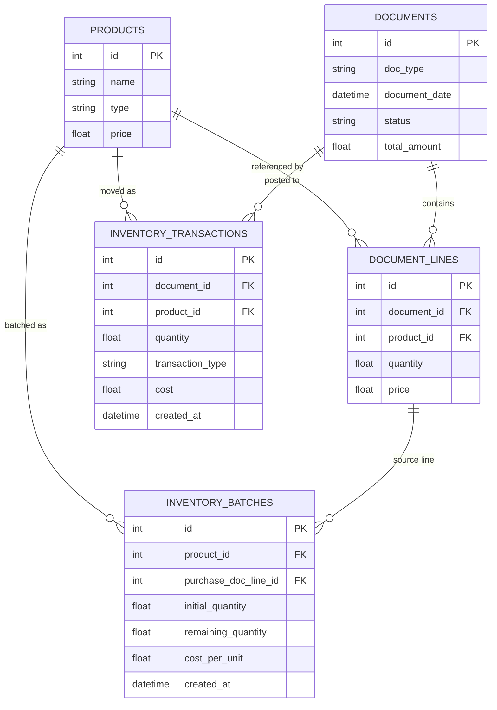
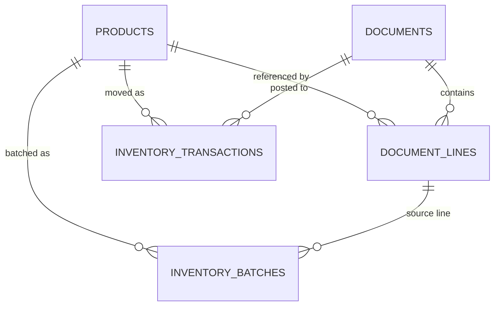

# Database Documentation (RU/EN)

## RU

### 1. Движок и расположение

- Основной движок: SQLite.
- Локальная БД: `server/1cremix.db`.
- Альтернативная БД в репозитории: `server/1cbas.db`.
- Путь может быть переопределен через `DB_PATH`.

### 2. Инициализация схемы

Схема создается в `server/db.js` при старте backend:
- `PRAGMA foreign_keys = ON`
- `CREATE TABLE IF NOT EXISTS ...` для всех таблиц
- авто-seed (если таблица `documents` пустая)

### 3. Схема таблиц

#### `products`

Назначение: справочник товаров/услуг.

Поля:
- `id INTEGER PRIMARY KEY AUTOINCREMENT`
- `name TEXT NOT NULL`
- `type TEXT CHECK(type IN ('goods', 'service')) NOT NULL`
- `price REAL NOT NULL`

#### `documents`

Назначение: заголовки документов.

Поля:
- `id INTEGER PRIMARY KEY AUTOINCREMENT`
- `doc_type TEXT CHECK(doc_type IN ('PurchaseInvoice', 'SalesInvoice', 'Order', 'InvoiceFactor', 'TaxInvoice')) NOT NULL`
- `document_date DATETIME DEFAULT CURRENT_TIMESTAMP`
- `status TEXT DEFAULT 'draft'`
- `total_amount REAL DEFAULT 0`

#### `document_lines`

Назначение: строки документов.

Поля:
- `id INTEGER PRIMARY KEY AUTOINCREMENT`
- `document_id INTEGER NOT NULL`
- `product_id INTEGER NOT NULL`
- `quantity REAL NOT NULL`
- `price REAL NOT NULL`

Связи:
- `document_id -> documents(id) ON DELETE CASCADE`
- `product_id -> products(id)`

#### `inventory_batches`

Назначение: FIFO-партии по поступлениям.

Поля:
- `id INTEGER PRIMARY KEY AUTOINCREMENT`
- `product_id INTEGER NOT NULL`
- `purchase_doc_line_id INTEGER NOT NULL`
- `initial_quantity REAL NOT NULL`
- `remaining_quantity REAL NOT NULL`
- `cost_per_unit REAL NOT NULL`
- `created_at DATETIME DEFAULT CURRENT_TIMESTAMP`

Связи:
- `product_id -> products(id)`
- `purchase_doc_line_id -> document_lines(id)`

#### `inventory_transactions`

Назначение: регистр движений склада.

Поля:
- `id INTEGER PRIMARY KEY AUTOINCREMENT`
- `document_id INTEGER NOT NULL`
- `product_id INTEGER NOT NULL`
- `quantity REAL NOT NULL`
- `transaction_type TEXT CHECK(transaction_type IN ('IN', 'OUT')) NOT NULL`
- `cost REAL NOT NULL`
- `created_at DATETIME DEFAULT CURRENT_TIMESTAMP`

Связи:
- `document_id -> documents(id)`
- `product_id -> products(id)`

### 4. ER-диаграмма

### 5. Бизнес-логика по данным

- `PurchaseInvoice` при post создает `IN` движения и FIFO-партии.
- `SalesInvoice` при post создает `OUT` движения и списывает из FIFO.
- Отчет прибыли рассчитывается по `OUT` движениям и выручке.
- Отчет склада строится по остаткам партий/движений.

### 6. Ограничения текущего хостинга backend на Vercel

- Serverless runtime в текущей версии backend работает с непостоянным runtime storage.
- Данные могут сбрасываться после cold start/redeploy.
- Для production persistence рекомендуется внешняя БД (PostgreSQL/MySQL/managed DB).

### 7. Рекомендации по улучшению схемы

- Добавить индексы:
  - `documents(document_date)`
  - `documents(doc_type, status)`
  - `document_lines(document_id)`
  - `inventory_transactions(product_id, created_at)`
  - `inventory_batches(product_id, remaining_quantity, created_at)`
- Добавить аудит-поля `created_by`, `updated_at`.
- Нормализовать статус документа (`CHECK` или отдельный справочник).

---

## EN

### 1. Engine and location

- Main engine: SQLite.
- Local DB: `server/1cremix.db`.
- Additional DB snapshot in repo: `server/1cbas.db`.
- Path can be overridden via `DB_PATH`.

### 2. Schema initialization

Schema is initialized in `server/db.js` on backend startup:
- `PRAGMA foreign_keys = ON`
- `CREATE TABLE IF NOT EXISTS ...` for all tables
- auto-seed (if `documents` table is empty)

### 3. Tables

#### `products`

Purpose: products/services catalog.

Columns:
- `id INTEGER PRIMARY KEY AUTOINCREMENT`
- `name TEXT NOT NULL`
- `type TEXT CHECK(type IN ('goods', 'service')) NOT NULL`
- `price REAL NOT NULL`

#### `documents`

Purpose: document headers.

Columns:
- `id INTEGER PRIMARY KEY AUTOINCREMENT`
- `doc_type TEXT CHECK(doc_type IN ('PurchaseInvoice', 'SalesInvoice', 'Order', 'InvoiceFactor', 'TaxInvoice')) NOT NULL`
- `document_date DATETIME DEFAULT CURRENT_TIMESTAMP`
- `status TEXT DEFAULT 'draft'`
- `total_amount REAL DEFAULT 0`

#### `document_lines`

Purpose: document lines.

Columns:
- `id INTEGER PRIMARY KEY AUTOINCREMENT`
- `document_id INTEGER NOT NULL`
- `product_id INTEGER NOT NULL`
- `quantity REAL NOT NULL`
- `price REAL NOT NULL`

Relations:
- `document_id -> documents(id) ON DELETE CASCADE`
- `product_id -> products(id)`

#### `inventory_batches`

Purpose: FIFO inventory batches from purchases.

Columns:
- `id INTEGER PRIMARY KEY AUTOINCREMENT`
- `product_id INTEGER NOT NULL`
- `purchase_doc_line_id INTEGER NOT NULL`
- `initial_quantity REAL NOT NULL`
- `remaining_quantity REAL NOT NULL`
- `cost_per_unit REAL NOT NULL`
- `created_at DATETIME DEFAULT CURRENT_TIMESTAMP`

Relations:
- `product_id -> products(id)`
- `purchase_doc_line_id -> document_lines(id)`

#### `inventory_transactions`

Purpose: inventory movements register.

Columns:
- `id INTEGER PRIMARY KEY AUTOINCREMENT`
- `document_id INTEGER NOT NULL`
- `product_id INTEGER NOT NULL`
- `quantity REAL NOT NULL`
- `transaction_type TEXT CHECK(transaction_type IN ('IN', 'OUT')) NOT NULL`
- `cost REAL NOT NULL`
- `created_at DATETIME DEFAULT CURRENT_TIMESTAMP`

Relations:
- `document_id -> documents(id)`
- `product_id -> products(id)`

### 4. ER diagram

### 5. Data behavior

- Posting `PurchaseInvoice` creates `IN` movements and FIFO batches.
- Posting `SalesInvoice` creates `OUT` movements and consumes FIFO batches.
- Profit report depends on `OUT` inventory movements and revenue.
- Inventory report is based on movement/batch balance logic.

### 6. Current backend-on-Vercel limitations

- Current serverless backend uses non-durable runtime storage.
- Data may reset after cold starts/redeploys.
- Durable production setup should use external DB (PostgreSQL/MySQL/managed DB).

### 7. Improvement recommendations

- Add indexes:
  - `documents(document_date)`
  - `documents(doc_type, status)`
  - `document_lines(document_id)`
  - `inventory_transactions(product_id, created_at)`
  - `inventory_batches(product_id, remaining_quantity, created_at)`
- Add audit fields (`created_by`, `updated_at`).
- Normalize document status domain (`CHECK` or reference table).
